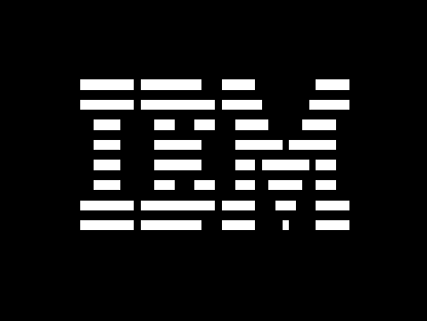
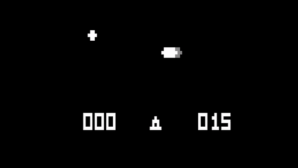
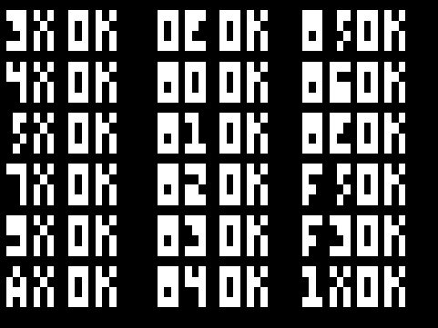
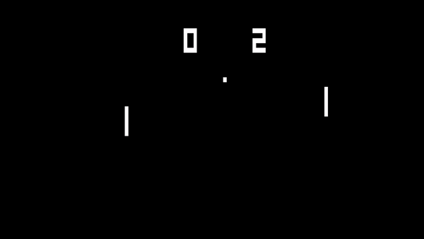
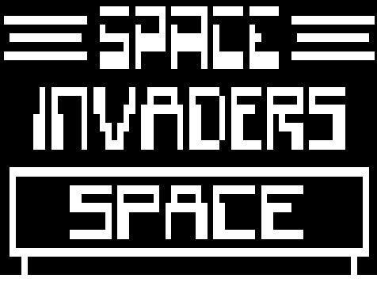
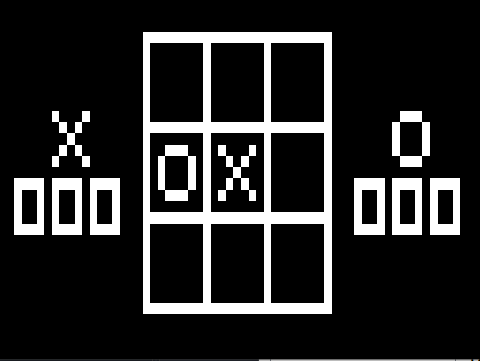
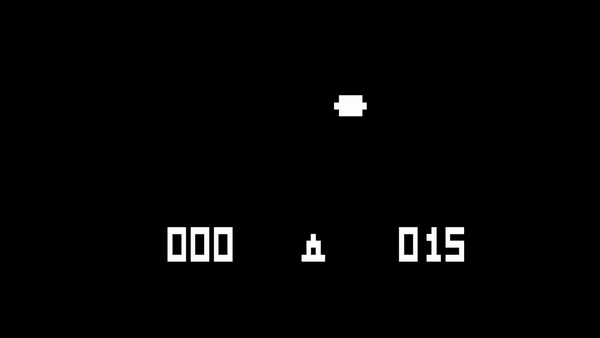
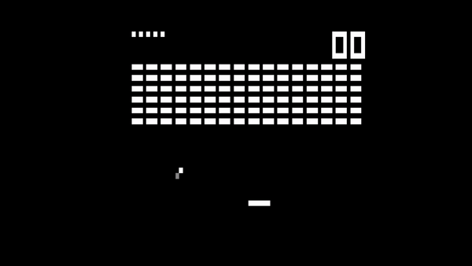

# CHIP-8 Emulator
| |  |
|----|----|
|  |  |
|  |  |
|  |

## Use
 * Provide a path to the rom without any whitespaces and cycle delay (it determines the speed of the game and may vary from game to game)
 * Note that some roms in the repo have whitespaces in it, so the filename must be edited before the rom is loaded 
 ### Example 
    ./CHIP-8.exe ./roms/INVADERS 1.7
    ./CHIP-8.exe ./roms/PONG 1.7
    ./CHIP-8.exe ./tests/IBMLogo.ch8 1.7
    ./CHIP-8.exe ./tests/Life[GVSamways,1980].ch8 1.7
    ./CHIP-8.exe ./games/Airplane.ch8 1.7
## Additional Features
### Flickering
to remove the natural flickering that is caused by xor operation on the screen,
the [old phosphor screen effect](https://faizilham.github.io/revisiting-chip8) is implemented

| No old phosphor screen | phosphor screen |
|----|----|
|  |  |
|  |  |
### Direct3D 11 
Direct3D is used to render image
